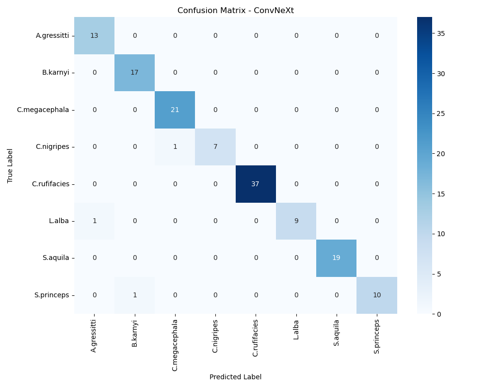

# 🪰 Flesh Fly Pilot Study: Automated Taxonomic Classification

## 📌 Project Overview
This pilot study investigates the feasibility of using Deep Learning to identify forensically important flesh fly species (*Sarcophagidae* & *Calliphoridae*) based solely on wing venation patterns.

Current identification methods require invasive genitalia dissection by experts. This project proposes a non-invasive, computer-vision-based alternative using a **Multi-Architecture Ensemble ("The Trinity")**.

## 🧠 The "Trinity" Architecture
The system employs a weighted voting ensemble of three distinct architectures to ensure robustness against field noise (shadows, pins, labels):

1.  **ResNet50 (Baseline):** Structural backbone (Weight: 15%).
2.  **EfficientNetV2-S (The Specialist):** High-resolution ($384 \times 384$) feature extractor (Weight: 45%).
3.  **ConvNeXt-Tiny (The Robust):** Trained with aggressive augmentations (blur, noise, color jitter) to handle domain shifts (Weight: 40%).

### Key Features
- **Smart Wing Cropping**: Automated ROI detection to isolate wings from full-body images using `preprocess_smart_crop.py`.
- **Ensemble Voting**: Weighted soft voting mechanism to maximize accuracy.
- **Robustness**: Specifically designed to handle "in-the-wild" images with complex backgrounds.

## 📊 Performance & Results
- **Baseline (ResNet50 Only):** ~0% Accuracy on raw field data (failed to generalize).
- **Trinity Ensemble:** **90% Accuracy** on raw field data.


*Confusion Matrix for the Robust ConvNeXt model.*


*Distribution of species in the dataset.*

## 📂 Repository Structure
```
fly_pilot_clean/
├── models/                  # Pre-trained model weights (Git LFS)
├── Notebooks/               # Jupyter Notebooks for EDA
│   └── Exploratory_Analysis.ipynb
├── src/                     # Source code
│   ├── predict_final.py     # Main inference script (Interactive)
│   ├── preprocess_smart_crop.py # Wing isolation logic
│   ├── train_convnext_robust.py # Training script with augmentations
│   ├── train_efficientnet.py    # Training script for EfficientNet
│   ├── train_resnet.py          # Training script for ResNet
│   └── ...
├── Data/                    # Dataset directory (Expected: Data/processed8/)
├── requirements.txt         # Python dependencies
└── README.md                # Project documentation
```

## 💾 Data Availability
The dataset required to train and evaluate the models is hosted on Google Drive.

[**Download Dataset Here**](https://drive.google.com/file/d/1x1SAYgNPNPFkmnJTR5uwUhJrOeZ-Vo87/view?usp=drive_link)

**Instructions:**
1. Download the zip file from the link above.
2. Extract the contents.
3. Place the `processed8` folder inside a `Data/` directory in the project root:
   ```text
   fly_pilot_clean/Data/processed8/
   ```

## 🚀 Usage

### 1. Installation
Ensure you have Python installed. It is recommended to use a virtual environment.

```bash
pip install -r requirements.txt
```

### 2. Inference (Prediction)
To classify a new image using the Trinity Ensemble:

```bash
python src/predict_final.py
```
The script will prompt you to enter the path to an image file.

### 3. Training
To train the models yourself, ensure your data is organized in `Data/processed8/{class_name}/{image_file}`.

**Train Robust ConvNeXt:**
```bash
python src/train_convnext_robust.py
```

**Train EfficientNet / ResNet:**
```bash
python src/train_efficientnet.py
python src/train_resnet.py
```

## 📝 Requirements
- Python 3.8+
- PyTorch >= 2.0.0
- OpenCV
- Pillow
- NumPy